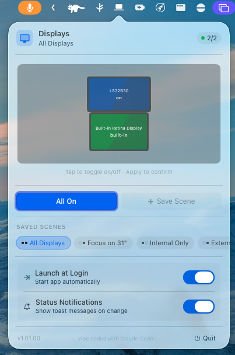

# InternalDisplayOff

A lightweight macOS menubar app that **disables/enables your MacBook's internal display** — giving you clamshell-mode benefits while keeping your keyboard, trackpad, and speakers fully functional.

> Vibe coded with [Claude Code](https://claude.ai/code)

<p align="center">
  
</p>

## Why?

macOS clamshell mode requires closing the lid, which disables the keyboard and speakers. This app lets you turn off just the built-in screen so you can:

- Use only your external monitor(s)
- Keep using the MacBook keyboard and trackpad
- Keep using the MacBook speakers
- Save battery/reduce heat from the unused display

## Features

- **Menubar app** — lives in your menubar, no Dock icon
- **One-click toggle** — click the menubar icon to open the control panel
- **Global shortcut** — press `⌃⌘D` (Ctrl+Cmd+D) to toggle instantly
- **Safety first** — automatically re-enables the internal display when the app quits
- **Smart detection** — won't disable the internal display unless an external display is connected
- **Display monitoring** — detects when displays are connected/disconnected
- **Launch at Login** — optional auto-start on login
- **Toast notifications** — unobtrusive HUD messages on display state changes (togglable)

## How It Works

Uses private CoreGraphics APIs (`CGSConfigureDisplayEnabled`) to programmatically disable/enable the built-in display at the system level. This is the same mechanism used by professional display management tools.

## Build

```bash
# Build the app
chmod +x build.sh
./build.sh

# Run it
open build/InternalDisplayOff.app

# Or install to Applications
cp -r build/InternalDisplayOff.app /Applications/
```

**Requirements:**
- macOS 13.0 (Ventura) or later
- Xcode Command Line Tools (`xcode-select --install`)
- An external display connected (for the toggle to work)

## Permissions

You may need to grant **Accessibility** permissions for the global keyboard shortcut to work:

1. Open **System Settings** → **Privacy & Security** → **Accessibility**
2. Add `InternalDisplayOff` to the allowed apps

## Keyboard Shortcut

| Shortcut | Action |
|----------|--------|
| `⌃⌘D` | Toggle internal display on/off |

## Safety

- The app **will not** disable the internal display if no external display is detected
- The app **automatically re-enables** the internal display when it quits
- If something goes wrong, simply quit the app from the menubar

## Technical Notes

- Uses `CGSConfigureDisplayEnabled` (private API) — not App Store compatible, but works great for personal use
- The internal display ID is cached on launch and backed up to `~/.internal_display_backup_id` so it can be restored even after being disabled or across reboots
- Uses `CGGetOnlineDisplayList` to detect displays (includes disabled ones)
- To update the displayed version, edit `CFBundleShortVersionString` in `Resources/Info.plist`

## Changelog

### v1.01.01
- **CPU fix — popover open:** Removed `.repeatForever` animation from the status dot, which was causing continuous 60fps SwiftUI re-renders of the entire popover view tree while open (~15% CPU → near 0%).
- **CPU fix — popover closed:** Added `NSPopoverDelegate.popoverDidClose` so the `NSHostingController` is always deallocated after close — including transient click-outside dismissals that previously kept `@ObservedObject` subscriptions alive indefinitely (~9% residual CPU → 0%).
- **Draft state fix:** Display thumbnails no longer show stale "→ OFF" after re-enabling a display; `draftEnabled` entries are now cleared whenever the actual display state changes.

### v1.01.00
- **Multi-display control:** All connected displays are now individually controllable — not just the built-in. Each display can be toggled on/off independently.
- **Spatial map:** The popover shows a live spatial map of your displays, mirroring their real-world arrangement. Tap any display thumbnail to stage a change.
- **Draft / Apply workflow:** Display changes are staged as a draft before being applied. Tap displays to toggle their intended state, then hit **Apply** to commit or **Reset** to cancel.
- **Display scenes:** Save any display arrangement as a named scene and restore it with one click. Scenes are persisted across launches.
- **Built-in scenes:** Automatically generated scenes that adapt to your connected hardware — *All Displays*, *Focus on [size]* (one per external), *Internal Only*, and *Externals Only*.
- **SkyLight API fallback:** Now resolves `SLSConfigureDisplayEnabled` from the SkyLight private framework first, falling back to `CGSConfigureDisplayEnabled`, improving compatibility across macOS versions.
- **`DisplayState` model:** Displays are represented with name, physical size (inches), resolution, spatial frame, built-in flag, and enabled state.
- **`SceneManager`:** New class managing scene persistence via `UserDefaults`, with separate built-in and user scene lists.

### v1.00.02
- **Bug fixes & thread safety:** Fixed a data race where the fallback timer read display state off the main thread; emergency hardware check now correctly executes on the main thread.
- **Consistent settings UI:** Toggle switches for Launch at Login and Status Notifications are now always aligned to the right side, matching system conventions.
- **Popover positioning fix:** Removed hardcoded `contentSize` in favour of `sizingOptions = .preferredContentSize`, fixing the popover rendering at the wrong position on screen.
- **WindowServer error fix:** Removed `NSApp.activate(ignoringOtherApps:)` call that was causing `FBSWorkspaceScenesClient` / scene invalidation errors in the system log.
- **Proper cleanup on quit:** Carbon hotkey and display reconfiguration callback are now correctly unregistered on app termination.
- **Login item sync:** Launch at Login toggle now re-syncs with the real system state each time the popover opens.
- **Logging:** Replaced `print()` throughout with `OSLog` / `Logger` for filterable, level-aware logging.
- **Dynamic version string:** Version number now reads from `Info.plist` — update `CFBundleShortVersionString` to change what the popover displays.
- **Build script:** Explicitly links Carbon, ServiceManagement, and Combine frameworks.

### v1.00.01
- **Robust Auto-Recovery:** The internal display now automatically and reliably turns back on when all external monitors are disconnected, bypassing macOS WindowServer sleep states and correctly filtering out virtual "ghost" displays.
- **HUD Toast Notifications:** Added sleek, unobtrusive floating toast messages to notify you when the internal display state changes (can be toggled in settings).
- **Reactive UI:** The menu bar icon now instantly and accurately reflects the display state using Combine, fixing occasional desync issues.
- **Hot-plug Stability:** Fixed a bug where rapidly plugging and unplugging external monitors caused duplicate ghost monitors to be counted.
- **Enhanced Backup System:** The internal display ID is now persistently backed up to both UserDefaults and a local hidden file (`~/.internal_display_backup_id`), ensuring recovery is always possible even across reboots or app crashes.
